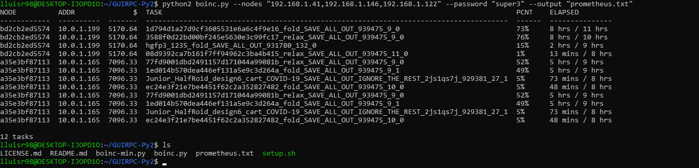
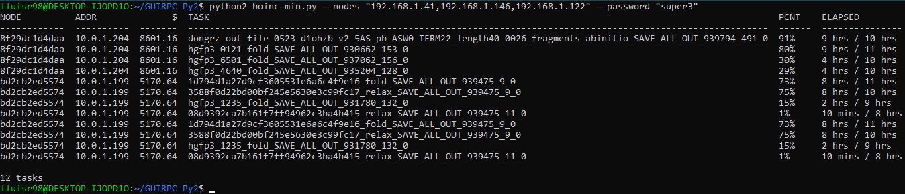

# Data collector for BOINC using RPC.
***
DEPRECATION: Python 2.7 reached the end of its life on January 1st, 2020. Please upgrade your Python as Python 2.7 is no longer maintained. pip 21.0 will drop support for Python 2.7 in January 2021. More details about Python 2 support in pip can be found at https://pip.pypa.io/en/latest/development/release-process/#python-2-support pip 21.0 will remove support for this functionality.
***

The code is written in Python 2, the commands are fully functional. In case of returning error in the execution of the code run with ```python2``` and install the dependencies manually. The code has been executed and tested on **Ubuntu 20.04 LTS** AMD64 version, Raspberry Pi 4 pre-configured image and Ubuntu 20.04 LTS in WLS. In other distributions could be functional without having to modify the code, the installation of packages can be different depending on the distribution and the version.

## Differences between boinc.py and boinc-min.py:
The code ```boinc.py``` is the corrected version of the original author, the ```--output``` parameter allows to create a .txt file ready to be imported in Prometheus. The code ```boinc-min.py``` is the corrected version of the original author and minimized of the original code, it does not allow to create a .txt file ready to be imported in Prometheus.

> **Possible issue**: The data collector does not always collect 100% of the BOINC tasks. This happens in the original version and the minimal version.

## How to install Python 2 and PIP:
### Method 1, manual mode:
```
sudo add-apt-repository universe
sudo apt update
sudo apt install python2 -y
curl https://bootstrap.pypa.io/get-pip.py --output get-pip.py
sudo python2 get-pip.py
sudo pip install tabulate
```

### Method 2, automated mode:
```
cd ./GUIRPC-Py2
chmod +x ./setup.sh
./setup.sh
```

## How to run boinc.py:
```
python[2] boinc.py --nodes "[IPs]" --password "[PASS]"
```

- [IPs]: Comma-separated IPs, e.g. ```--nodes "192.168.1.10,192.168.1.11,192.168.1.13"```. They have to be accessible, be careful with services denying requests (like iptables).
- [PASS]: Communication password (same password that was used to create the Docker containers), ```--password "qwerty"```. Please do not use ```qwerty``` or similar as a password, use a more secure password... ;)
- Extra:
    -   ```--port "9999"```: You can specify a communication port, by default ```31416```.
    -   ```--output "archivo.txt"```: You can specify if you want it to be saved.



## How to run boinc-min.py:
```
python[2] boinc-min.py --nodes "[IPs]" --password "[PASS]"
```

- [IPs]: Comma-separated IPs, e.g. ```--nodes "192.168.1.10,192.168.1.11,192.168.1.13"```.
- [PASS]: Communication password, e.g. ```--password "qwerty"```. Please do not use ```qwerty``` or similar as a password, use a more secure password... ;)
- Extra:
    -   ```--port "9999"```: You can specify a communication port, by default ```31416```.



## Credits:

Thanks to the [@maesoser](https://github.com/maesoser) user for sharing the code he uses for the export of BOINC data. The original code (at least until 26/05/2020) does not have a specific license, speaking with him has preferred to share it under MIT license.

 
